 
 


 
 


<p align="left">

</p>


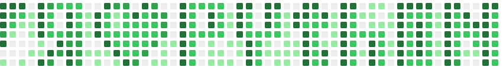


Read this in other languages: [Russian](README.ru.md), [हिन्दी](README.hindi.md), [中國人](README.chinese.md)

# GitHub Contributions
If you want to beautify your GitHub activity history, then the capabilities of the Python script ``github_paint.py``
will help you replace contributions for the specified period.

## Redoing the activity on GitHub, drawing in the profile
As a source, you must prepare an image of 52 by 7 pixels in advance: it will
automatically converted into commits on your behalf to your separate repository.


This program itself initializes an empty repository with the README.md file and starts generating file updates with
adding contributions: YYYY-MM-DD HH:MM for each commit of your commit.

Uses the --date switch to create
commits in the past.

### How to use
1. Create a new empty GitHub repository. Do not include a README.md file and do not initialize the repository.
2. Clone this repository or copy the github_paint.py file and your commits drawing.
3. In the repository, open the html page Git.html and draw your drawing
4. Save your drawing
5. Convert it to 52x7
6. Change the lines in github_paint.py with the file name of your drawing and the last day of the year in which you will
   post your drawing
7. Run the github_paint.py program with the key (the address of your repository) as shown in the example below:

```commandline
python github_paint.py --repository = https: //github.com/user/repo.git
```
(HTTPS Method: Account Authentication)
The process takes not so much time (3-5 minutes).
7. Enjoy the result

> Note:
If you once used this script in the repository, then you will not be able to repeat it with the same repository.
You will have to create another repository or else you will get errors in the script logs.
Emphasis on using a repository that has not been initialized.


### Work examples:
1. Initial drawing `ГЕНОМ`:

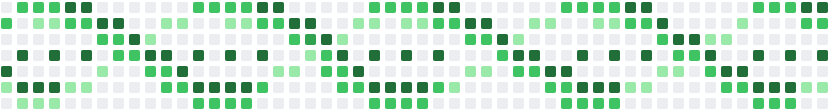

The same drawing but in 52x7 resolution:


Result:
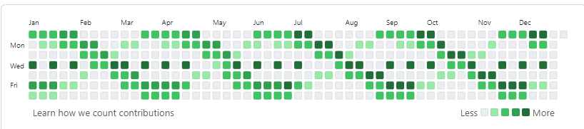

2. Initial drawing  `Я люблю Python`:


The same drawing but in 52x7 mode:


Result:
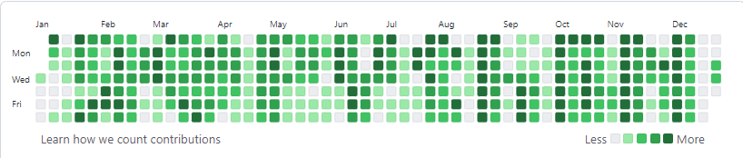

2. Initial drawing  `Я люблю Python`:

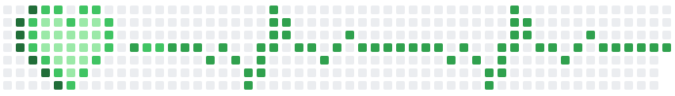

The same drawing but in 52x7 mode:


Result:


3. Initial drawing  `I love you`:

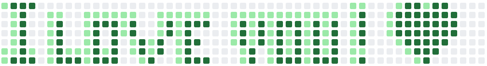

The same drawing but in 52x7 mode:


Result:

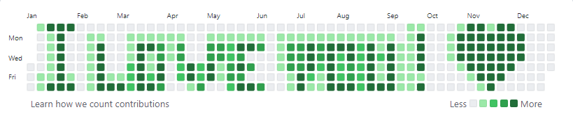

4. Initial drawing  `bugs, hex, sux`:

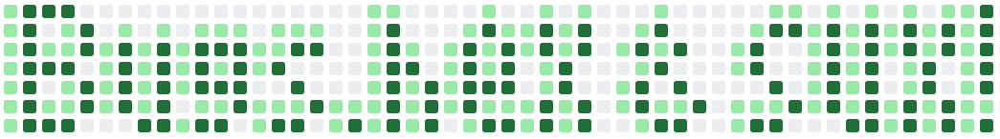

The same drawing but in 52x7 mode:


Result:

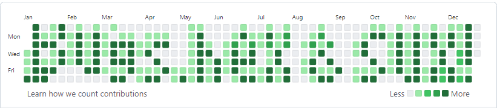


5. Initial drawing  `do it`:

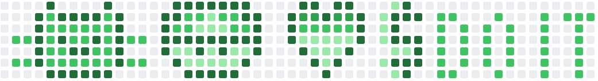

The same drawing but in 52x7 mode:


Result:
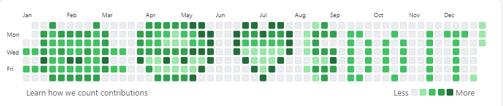

6. Initial drawing `pacman`:

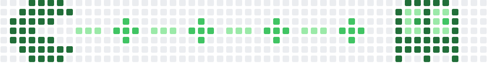

The same drawing but in 52x7 mode:


Result:
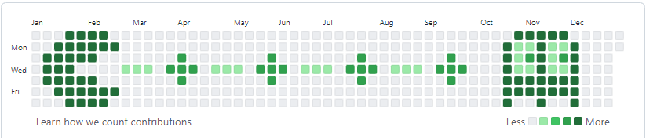

7. Initial drawing  `send nudes`:

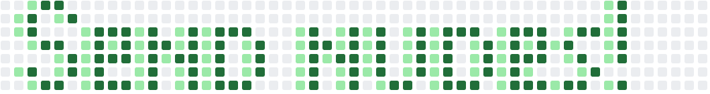

8. Initial drawing  `sex_drugs_alco`:

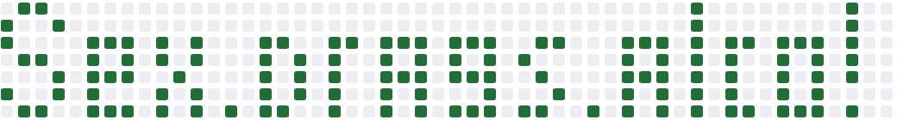

All examples of work are placed in the folder `example`
ps long-term plans to create a GUI application or html page where you can perform all operations from
drawing before uploading to the repository, but there is no time for this yet ..... so all enthusiasts  develop this 
project
I invite you to participate, create your own branch.

p.s.s. If you liked the project, do not forget to put a star, and if you are interested, then sign up as a follower.
